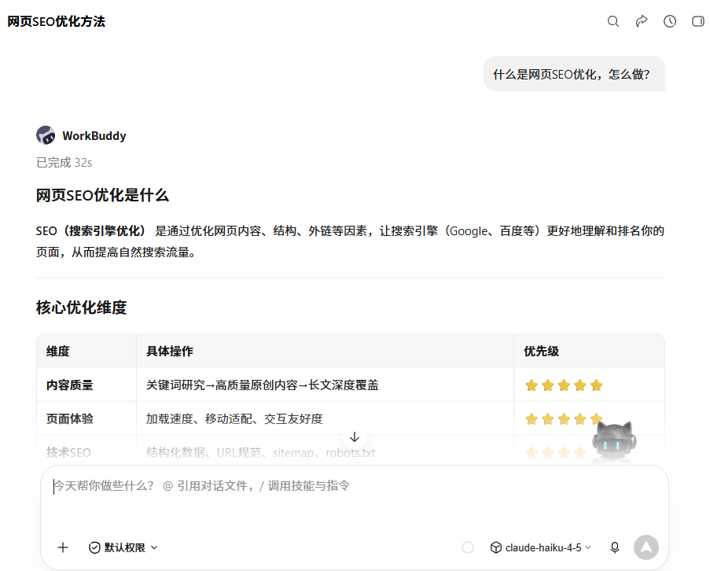
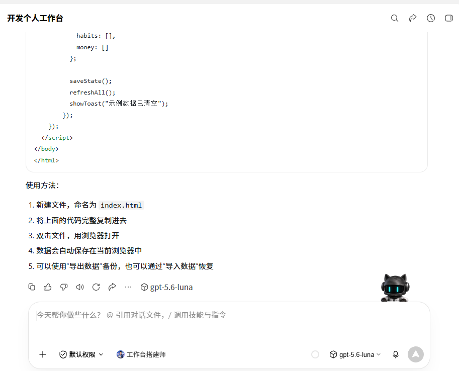
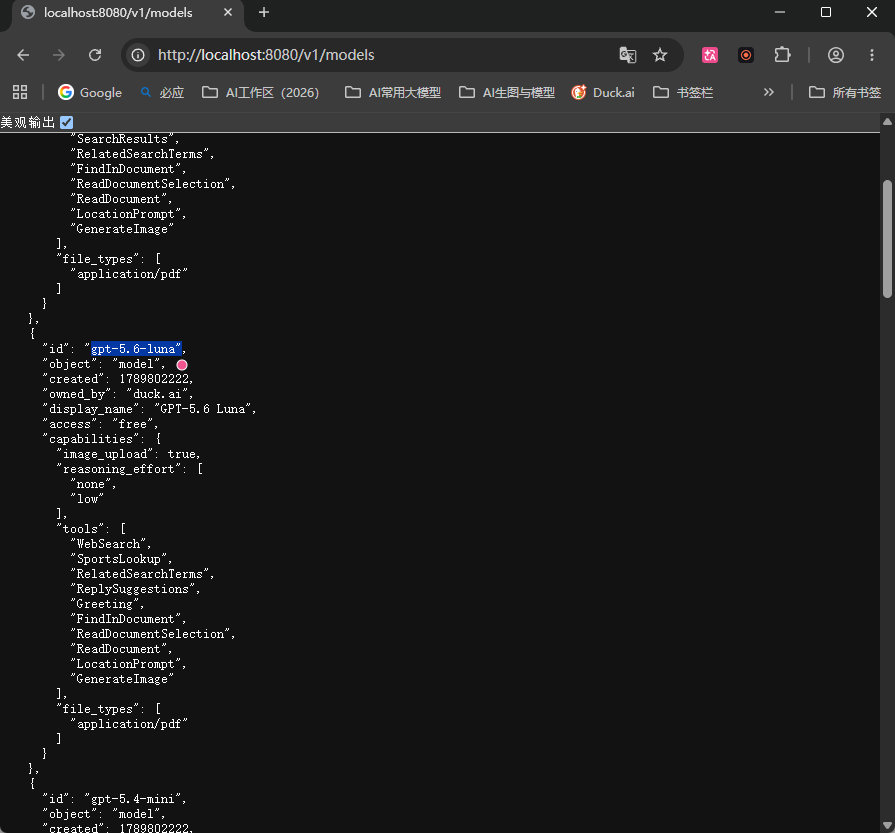
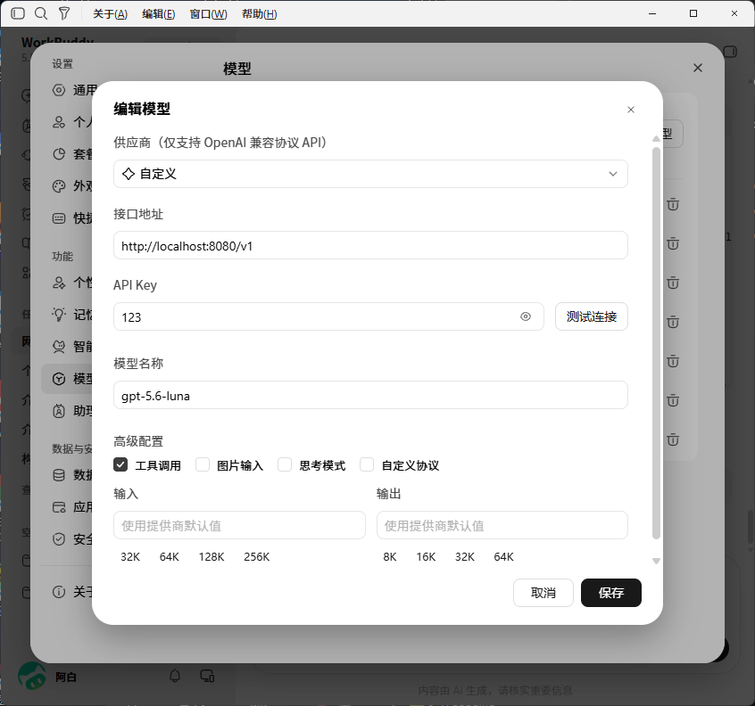

<div align="center">

# 🦆 DuckAI2API

**将 Duck.ai 变成兼容 OpenAI / Anthropic / Responses 的 API —— 免费。**

[🇨🇳 中文](./README.zh.md) · [🇬🇧 English](./README.md)

</div>

---

一个同时讲 **三种** LLM 协议的中转服务，后端是 **Duck.ai**（`https://duck.ai/`）——无需 API Key，无需付费。基于对 Duck.ai 实时 Web 协议（XHR + SSE，无官方 API）的反向分析构建，并在每次网站大改后重新验证。

可作为 **Claude Code**、**OpenAI SDK**、**OpenAI Responses API** 的即插即用后端，也能接入 WorkBuddy 等第三方 IDE。所有聊天均来自 Duck.ai 真实的 SSE 流。

### 效果演示

| 第三方 IDE（WorkBuddy）对话 | 生成代码任务 |
|---|---|
|  |  |

**GPT Image 2 生图**（`/v1/images/generations`，提示词：*一只戴着红色围巾的柴犬坐在雪地里，背景是松树和飘雪，暖光，高清摄影风格*）：


## ✨ 为什么做这个

Duck.ai 没有公开 API。它的聊天走以下接口：

- `GET https://duck.ai/duckchat/v1/models` — 公开模型目录（含免费/付费档与能力标记，本中转据此动态列出模型）
- `POST https://duck.ai/duckchat/v1/chat`，请求头 `Accept: text/event-stream` — SSE 聊天流，逐 token 为 `data: {"action":"success","message":"…"}`，以 `data: [DONE]` 结束
- 聊天请求必须携带 `x-fe-signals` / `X-Vqd-Hash-1` 等由页面 JS 现场生成的反爬令牌，**无法离线重放**；因此本中转用真实 Chrome 驱动页面自身的发送逻辑（详见 `duckai.py` 顶部注释）

模型 id 在 JSON 体中以 `model: "<model>"` 发送。中转服务会把友好的模型名映射到这些 id。

## 🚀 功能

| | 能力 |
|---|---|
| 🧠 **动态免费模型** | 实时目录：GPT-5.6 Luna、GPT-5.4 mini、Claude Haiku 4.5、Mistral Small、gpt-oss 120B、Gemma 4 31B 等 |
| 🔌 **三协议** | `/v1/chat/completions`（OpenAI）、`/v1/messages`（Anthropic）、`/v1/responses`（OpenAI Responses） |
| 🖼️ **图像生成** | `/v1/images/generations`（OpenAI 形状）：驱动 GPT-5.6 Luna 原生 `GenerateImage`（后端 GPT Image 2），返回 `b64_json` 或本地 `url` |
| 🌊 **真实流式** | 所有协议按 Duck.ai SSE 的逐 token 粒度流式输出 |
| ♻️ **会话复用** | 连续对话复用已预热的页面并利用 Duck.ai 原生多轮上下文，续聊省去约 7 秒预热 |
| 🧮 **推理档透传** | `reasoning_effort`（OpenAI）/ `thinking`（Anthropic）映射到 Duck.ai 的 `reasoningEffort`，服务端改写失败自动降级 |
| 🤖 **Agent 工具循环（实验）** | 需 `DUCKAI_TOOL_ROUTING=1` 开启：根据用户意图合成 `tool_use` / `tool_calls` / `function_call`，把 `tool_result` 回传给 Duck.ai。**服务端绝不执行命令** |
| 🔄 **会话轮换** | 按模型维护无头 Chrome 会话，限流/崩溃时自动重建 |
| 🔐 **可选 Key 鉴权** | 设置 `DUCKAI_API_KEY`，请求带上 `Authorization: Bearer <key>` |
| 🪟 **跨平台** | Windows · macOS · Linux |

## 📦 模型

`/v1/models` 实时拉取 Duck.ai 的 `GET /duckchat/v1/models`，附带 `access`（free/paid）与 `capabilities`（图像上传、推理档位、工具）标记。截至 2026-09-19：

| id                     | 名称            | 档位 |
|------------------------|-----------------|------|
| `gpt-5.6-luna`         | GPT-5.6 Luna    | 免费 |
| `gpt-5.4-mini`         | GPT-5.4 mini    | 免费 |
| `claude-haiku-4-5`     | Claude Haiku 4.5| 免费 |
| `mistral-small-2603`   | Mistral Small 4 | 免费 |
| `tinfoil/gpt-oss-120b` | gpt-oss 120B    | 免费 |
| `tinfoil/gemma4-31b`   | Gemma 4 31B     | 免费 |
| `gpt-5.6-terra` / `gpt-5.6-sol` | GPT-5.6 Terra / Sol | 付费（plus/pro） |
| `claude-sonnet-4-6` / `claude-opus-4-8` | Claude Sonnet 4.6 / Opus 4.8 | 付费（plus/pro） |

> 旧的 `gpt-5.4`（无 mini）已在 2026-09-18 下线，`gpt-5.4` / `gpt-4o` 等别名现解析到 `gpt-5.4-mini`。付费档模型仍可通过本中转发送（沿用你浏览器的 Duck.ai 身份），是否放行取决于 Duck.ai。

未知的模型 id 会原样透传（未来的 Duck.ai 模型无需改代码即可用）。常用别名（`gpt-5.6`、`claude-haiku`、`o3-mini` 等）会自动解析到上表。

在浏览器打开 `http://localhost:8080/v1/models` 即可看到实时目录（含 `access` 档位与 `capabilities` 能力标记）：



## 🛠️ 环境要求

- **Python** ≥ 3.10
- 主机上安装 **Google Chrome（稳定版）**。中转服务通过真实 Chrome 实例（`Playwright` 的 `channel="chrome"`）驱动 Duck.ai；Playwright 自带的 Chromium 会被 Duck.ai 指纹封禁，因此必须用系统 Chrome。你**不需要**执行 `playwright install chromium`。
  - Windows：从 <https://www.google.com/chrome/> 安装
  - macOS：`brew install --cask google-chrome`
  - Linux（Debian/Ubuntu）：`sudo apt-get install google-chrome-stable`
- 如果 Chrome 不在默认路径，用 `DUCKAI_CHROME_PATH` 指向二进制文件。

## ⚡ 快速开始

```bash
# 1. 虚拟环境
python3 -m venv .venv
#    Windows:        .venv\Scripts\activate
#    macOS / Linux:  source .venv/bin/activate

# 2. 依赖
pip install -r requirements.txt

# 3. （可选）配置
cp example.env .env             # API Key、代理等

# 4. 启动
python -m uvicorn main:app --host 0.0.0.0 --port 8080
#    Windows 也可直接双击 start.bat（stop.bat 停止）
```

服务监听 `http://localhost:8080`（可用 `PORT` 覆盖）。验证：浏览器打开 `http://localhost:8080/v1/models` 应返回模型 JSON 列表。

## ⚙️ 配置

所有配置均为可选，从环境变量读取（通过 `python-dotenv` 加载 `.env`）。

| 变量                  | 说明                                                                                          | 默认值               |
|-----------------------|-----------------------------------------------------------------------------------------------|----------------------|
| `DUCKAI_API_KEY`      | 所有 `/v1` 请求所需的 Bearer 令牌。**留空 = 开放访问。**                                      | *(空)*               |
| `DUCKAI_BASE`         | Duck.ai 主机地址。                                                                             | `https://duck.ai`    |
| `DUCKAI_MODEL`        | 客户端未指定时的默认模型。                                                                     | `gpt-5.6-luna`       |
| `DUCKAI_NEW_CHAT`     | `1` = 每次请求新建对话（无状态）；`0` = 保留会话历史。                                         | `0`                  |
| `DUCKAI_TOOL_ROUTING` | `1` = 开启意图→工具合成路由。**默认关闭**：agent 客户端（WorkBuddy/Claude Code）总带 `tools`+超长上下文，正则误命中会返回 `content:null` 导致 IDE 报「模型无响应」。 | `0`                  |
| `DUCKAI_PROXIES`      | 逗号分隔的代理池；借此轮换以绕过按 IP 的 `ERR_BN_LIMIT` 封禁。                                 | *(无)*               |
| `DUCKAI_PROXY`        | 单个代理（代理池的替代方案）。                                                                 | *(无)*               |
| `DUCKAI_MAX_CONCURRENCY` | 每个代理在排队前的最大并发请求数。                                                        | `2`                  |
| `DUCKAI_CHROME_PATH`  | 覆盖 Google Chrome 二进制路径（否则按系统自动探测）。                                          | 各系统默认值         |
| `PORT`                | 服务端口。                                                                                     | `8080`               |

## 💡 使用示例

### OpenAI SDK（流式）

```python
from openai import OpenAI
c = OpenAI(base_url="http://localhost:8080/v1", api_key="t")  # 未开启鉴权时任意 key 均可
stream = c.chat.completions.create(
    model="gpt-5.6-luna",
    messages=[{"role": "user", "content": "用一句话解释量子隧穿。"}],
    stream=True,
)
for chunk in stream:
    print(chunk.choices[0].delta.content or "", end="", flush=True)
```

### Anthropic SDK（Claude Code）

```python
from anthropic import Anthropic
c = Anthropic(base_url="http://localhost:8080", api_key="t")
c.messages.create(
    model="gpt-5.6-luna",
    max_tokens=1024,
    messages=[{"role": "user", "content": "2+2 等于多少？"}],
)
```

将 Claude Code 指向中转服务：`ANTHROPIC_BASE_URL=http://localhost:8080` 且 `ANTHROPIC_API_KEY=t`。

### 第三方 IDE 接入（WorkBuddy 等 OpenAI 兼容客户端）

在 IDE 的「自定义模型 / 供应商」设置中填写：

| 字段 | 值 |
|---|---|
| 接口地址（base_url） | `http://localhost:8080/v1`（**OpenAI 协议要带 `/v1`**） |
| API Key | 任意值（如 `123`；`.env` 中 `DUCKAI_API_KEY` 留空时不校验） |
| 模型名称 | `gpt-5.6-luna` / `claude-haiku-4-5` / `gpt-5.4-mini` 等（见上文模型表） |
| 请求超时 | 建议 ≥60 秒（冷启动首轮含 Chrome 预热约 7–15 秒） |



> 注意：agent 模式会携带 `tools` 与数万字符上下文。Duck.ai 输入框硬上限约 1.2 万字符，超出部分由中转自动截断（保留系统指令开头 + 最新问题），因此适合问答与轻量任务，不适合全工程理解类重度 agent 工作流。

### 工具循环（实验性，默认关闭）

需先在 `.env` 设 `DUCKAI_TOOL_ROUTING=1`。像给 Claude 一样发送 `tools`，中转根据用户意图发出 `tool_use` 块；你的 agent 在本地执行并返回 `tool_result`，中转再把它转发给 Duck.ai 得到有依据的最终回答。**默认关闭的原因**：agent 客户端（WorkBuddy / Claude Code 等）总带 `tools` 与数万字符上下文，正则误命中会返回 `content:null` 的合成响应，被 IDE 判为「模型无响应」。关闭时带 `tools` 的请求按普通聊天走 Duck.ai。

```python
tools=[{"name":"Read","description":"读取文件",
        "input_schema":{"type":"object","properties":{"file_path":{"type":"string"}}}}]
# 用户："读取 README.md"  ->  中转返回 tool_use: Read {file_path:"README.md"}
# agent 本地执行 Read，返回 tool_result；中转据此作答。
```

### 图像生成（OpenAI Images 形状）

Duck.ai 没有独立的生图 API——GPT-5.6 Luna 在对话轮里原生调用 `GenerateImage`（后端为 GPT Image 2）。中转服务驱动这一轮，取出 SSE 中 `status:"success"` 帧携带的完整 base64 JPEG。

```bash
curl -X POST http://localhost:8080/v1/images/generations \
  -H "Content-Type: application/json" \
  -d '{"model":"gpt-image-1","prompt":"一只穿宇航服的橘猫漂浮在星空中","response_format":"b64_json"}'
```

- `model`：`gpt-image-1` / `gpt-image-2` / `dall-e-3` 均别名到 `gpt-5.6-luna`（唯一能触发原生生图的免费模型）。
- `response_format`：`b64_json` 直接返回图片字节；缺省 `url` 返回 `/v1/images/content/<id>` 本地链接（内存缓存约 50 张）。
- `n`：1–4，逐张生成；`size`：如 `1024x1024`，仅影响构图提示（横/竖/方）。
- 单次生成约 25–30 秒（含预热与后端出图）。

```python
from openai import OpenAI
c = OpenAI(base_url="http://localhost:8080/v1", api_key="t")
r = c.images.generate(model="gpt-image-1", prompt="水墨风格的红狐", response_format="b64_json")
open("fox.jpg", "wb").write(__import__("base64").b64decode(r.data[0].b64_json))
```

## 📂 文件结构

- `duckai.py` — Duck.ai 传输层：真实 Chrome 会话管理、fetch-hook 响应 tee、请求体改写（model / reasoningEffort / toolChoice）、事件流解析（`_parse_event` → `send_ui` / `send_stream_ui` / `send_image_ui`）、超长 prompt 截断、封禁轮换。导出 `MODEL_LABELS`、`resolve_model`、`DuckAISession`、`fetch_model_catalog`。
- `main.py` — FastAPI 应用：聊天（OpenAI / Anthropic / Responses）、图像（`/v1/images/generations` + 内存图片缓存）、`/v1/models` 动态目录、对话扁平化、请求日志（`REQ` / `ROUTED` 行）。
- `tools.py` — 解析模型输出中的 `<tool_call …>` XML 信封（`split_text_and_tool`）。
- `toolrouter.py` — 实验性意图 → `tool_use` 合成（`DUCKAI_TOOL_ROUTING=1` 时生效）。
- `start.bat` / `stop.bat` — Windows 一键启停。
- `example.env` — 全部配置项模板（复制为 `.env`）。
- `docs/images/` — 文档截图与示例图。

## ⚠️ 已知限制（2026-09-19 实测）

- **上下文上限约 1.2 万字符**：Duck.ai 输入框有硬上限，超出部分由中转自动截断（保留开头指令 + 结尾最新问题）。因此不适合"理解整个工程"式的重度 agent 任务。
- **延迟**：冷启动首轮约 7–15 秒（Chrome 预热），续聊约 5–10 秒，生图约 25–30 秒。客户端超时建议 ≥60 秒。
- **生图仅 GPT-5.6 Luna 可触发**（免费档中唯一原生带 `GenerateImage` 工具的模型）。
- **封禁风险**：Duck.ai 会对异常流量按 IP/指纹下发 `ERR_BN_LIMIT` 持久封禁；中转会自动重建会话/轮换代理，但请控制使用频率并遵守其服务条款。
- 服务端行为随时可能变化（模型上下架、协议字段调整）；出问题先看 `server.log` 的 `REQ` 日志，再对照 `/v1/models` 实时目录。

## 📬 联系方式

- 邮箱：[wuyouseo@gmail.com](mailto:wuyouseo@gmail.com)
- Telegram：https://t.me/aleiseo

## ⚠️ 免责声明

与 DuckDuckGo 无关。仅用于学习/个人用途；请遵守 Duck.ai 的服务条款。使用时自行承担限流风险。
